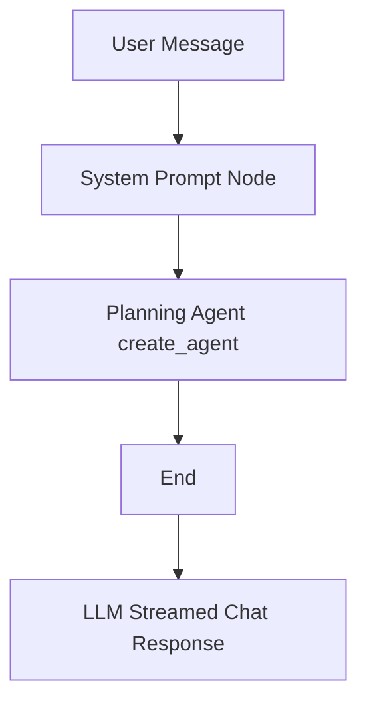

# Agents Architecture

This folder contains the LangGraph-based chat orchestration for Capple.

## Workflow Pattern

- Static flow: `system_prompt_node` runs first.
- Single tool agent: `planning_agent` runs second and uses all tools.
- Streaming output: backend still returns streamed chatbot text only.

## Current Nodes

1. `system_prompt_node`: composes the system prompt.
2. `planning_agent`: minimal `create_agent` invocation with all tools.

## Tools

Tools are defined under `tools/` and exposed as LangChain tools:

- `fetch_weather_context`: weather context for a city.
- `get_city_events`: event candidates for supported cities.
- `get_battery_tool`: household battery insights for the last 30 days.
- `get_datetime_tool`: UTC + selected-city local datetime.
- `rank_city_plans`: deterministic ranking from context + events.

## Notes

- The current event adapters are deterministic stubs for Berlin and Madrid.
- The planning node does not mutate message history.
- The architecture diagram is stored as `architecture_b_multi_agent.svg` in this folder.
