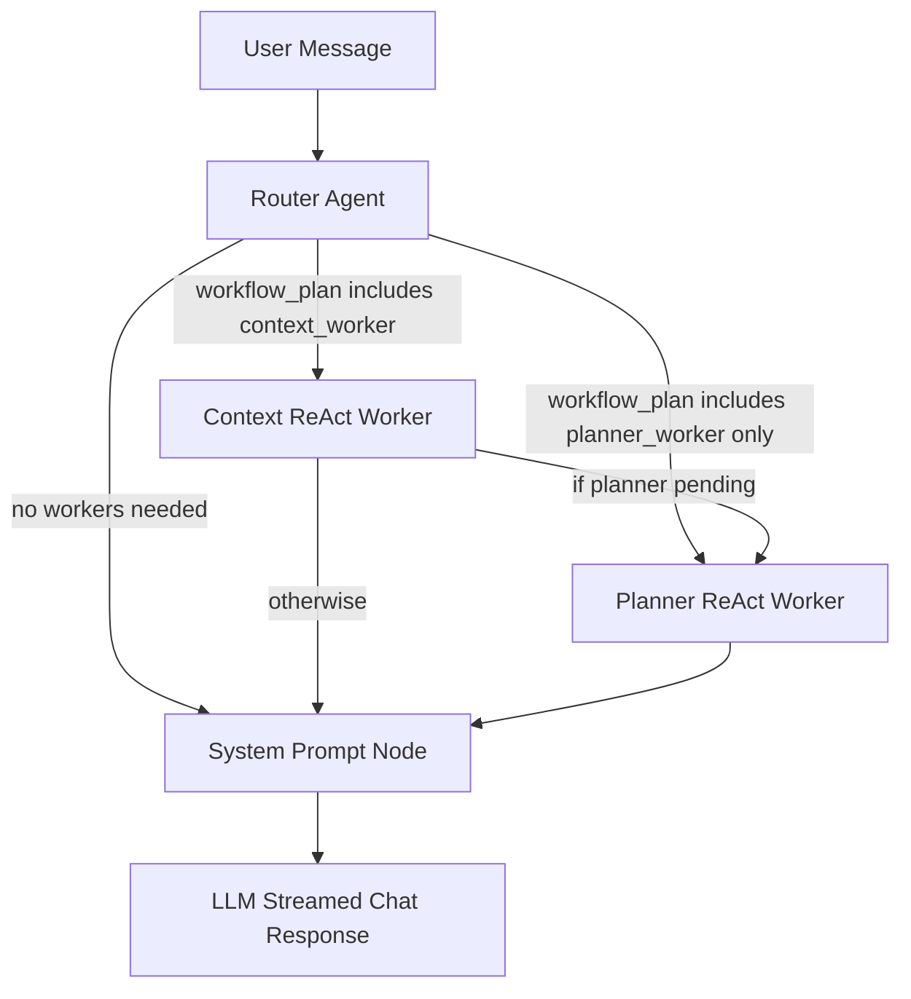

# Agents Architecture

This folder contains the LangGraph-based chat orchestration for Capple.

## Workflow Pattern

- Hybrid routing: deterministic rules first, LLM fallback when uncertain.
- Dynamic workflow: router creates `workflow_plan` state (workers to run).
- ReAct workers: context and planner workers use LangChain tools.
- Streaming output: backend still returns streamed chatbot text only.

## Current Nodes

1. `router_agent`: intent + city + consent detection, builds `workflow_plan`.
2. `context_worker`: ReAct worker gathering battery/datetime/weather.
3. `planner_worker`: ReAct worker fetching events and ranking plans.
4. `system_prompt_node`: composes final system prompt from available context.

## Tools

Tools are defined under `tools/` and exposed as LangChain tools:

- `fetch_weather_context`: weather context for a city.
- `get_city_events`: event candidates for supported cities.
- `get_battery_context`: household battery insights for the last 30 days.
- `get_datetime_context`: UTC + selected-city local datetime.
- `rank_city_plans`: deterministic ranking from context + events.

## Notes

- The current event adapters are deterministic stubs for Berlin and Madrid.
- Failure policy in workers: retry once, then continue with partial context and log errors.
- The architecture diagram is stored as `architecture_b_multi_agent.svg` in this folder.
